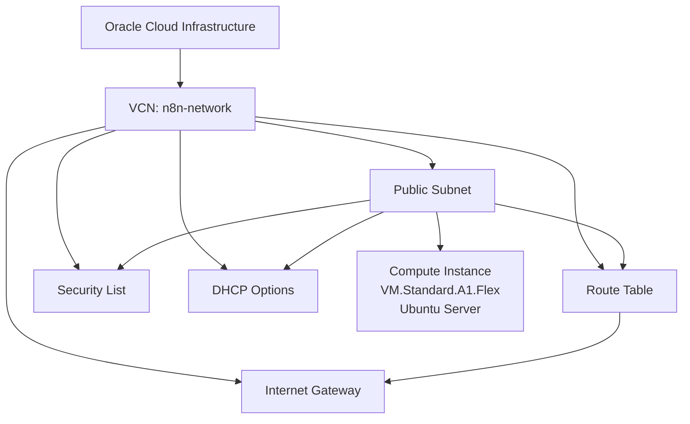

# Terraform OCI Infrastructure

Infrastructure as Code project for managing an existing Oracle Cloud Infrastructure environment with Terraform.

The project was built around a live OCI environment and gradually migrated under Terraform management without recreating production resources.

## Architecture



## Managed Resources

Terraform currently manages:

- OCI Compute Instance
- Virtual Cloud Network
- Public Subnet
- Internet Gateway
- Route Table
- Security List
- DHCP Options

The existing cloud resources were imported into Terraform state instead of being recreated.

## Remote State

Terraform state for the main infrastructure is stored remotely in OCI Object Storage.

The bootstrap configuration manages the Object Storage bucket used by the infrastructure backend.

Local state files, Terraform variable files, private keys, and local provider directories are excluded from Git.

## Safety

The migration followed a no-recreation approach:

1. Discover existing OCI resources.
2. Generate Terraform configuration.
3. Import existing resources into Terraform state.
4. Add lifecycle protection where appropriate.
5. Run `terraform plan`.
6. Continue only when the plan shows no infrastructure changes.
7. Replace hard-coded resource relationships with Terraform references.
8. Verify again with `terraform plan`.

Expected result:

`No changes. Your infrastructure matches the configuration.`

## Technologies

- Terraform
- Oracle Cloud Infrastructure
- OCI Terraform Provider
- OCI Object Storage
- Ubuntu Linux
- Git
- GitHub
- SSH

## Skills Demonstrated

- Terraform resource import
- Infrastructure as Code
- OCI networking
- Remote Terraform state
- Terraform dependency management
- State safety
- Git version control
- SSH authentication

## Repository Structure

- `bootstrap/` — creates and manages the Object Storage backend resources
- `infrastructure/` — manages the OCI compute and network infrastructure
- `.gitignore` — excludes Terraform state, local variables, provider cache, and private keys

## Prerequisites

Before using this project, make sure you have:

- Terraform installed
- An Oracle Cloud Infrastructure account
- OCI API credentials configured in `~/.oci/config`
- Access to the target OCI compartment
- SSH access to the managed server
- Git installed

The OCI provider uses the `DEFAULT` profile from the local OCI configuration.

## Configuration

Example variable files are included in both Terraform directories:

- `bootstrap/terraform.tfvars.example`
- `infrastructure/terraform.tfvars.example`

For a new environment, copy the example file and replace the placeholder values with your own OCI configuration.

Do not overwrite an existing `terraform.tfvars` file in a live environment.

Real `terraform.tfvars` files are excluded from Git through `.gitignore`.

## Usage

### Bootstrap

The `bootstrap/` directory is used to create and manage the OCI Object Storage bucket used for Terraform remote state.

```bash
cd bootstrap
terraform init
terraform validate
terraform plan
terraform apply
```

### Infrastructure

The `infrastructure/` directory manages the main OCI network and compute resources.

```bash
cd infrastructure
terraform init
terraform validate
terraform plan
terraform apply
```

Always review the output of `terraform plan` before running `terraform apply`.

For this project, imported production-like resources are protected with lifecycle safeguards where appropriate, and destructive changes should be reviewed carefully before applying.

## Validation Workflow

Before committing infrastructure changes:

1. Run `terraform fmt -recursive`.
2. Run `terraform validate` in each Terraform directory.
3. Review `terraform plan`.
4. Commit only after confirming the planned changes are expected.
